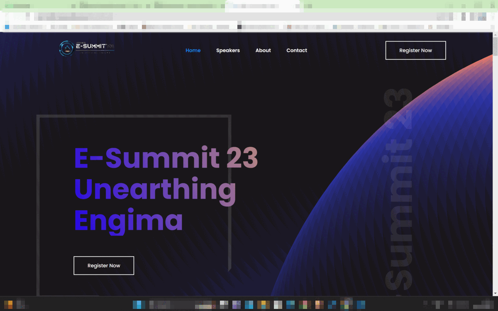

# Esummit 23

## Link to the Website : [Click here](https://kartik-katkar.github.io/Esummit-23/)

## Screenshots 

 

  

 

## About E-summit

ESummit is a highly anticipated event that aims to bring together entrepreneurs, innovators, and business leaders from all around the world. This exciting event is designed to provide a platform for learning, networking, and collaboration for those who are passionate about entrepreneurship and innovation.

The website for ESummit has been carefully crafted to provide visitors with all the information they need to make the most of this incredible event. The site features a sleek and modern design that is both visually appealing and user-friendly, making it easy for visitors to navigate and find the information they need.

From the homepage, visitors can quickly and easily learn more about the event, its schedule, and its speakers. The site also features a registration page, where visitors can purchase tickets and sign up to attend the event. Additionally, the site features a blog section, where visitors can stay up-to-date on the latest news and announcements related to ESummit.

Whether you are an entrepreneur looking to connect with other like-minded individuals, a business leader seeking new ideas and insights, or an innovator looking to showcase your latest products and services, ESummit is the perfect event for you. So why wait? Visit the ESummit website today to learn more and register for this exciting event!
